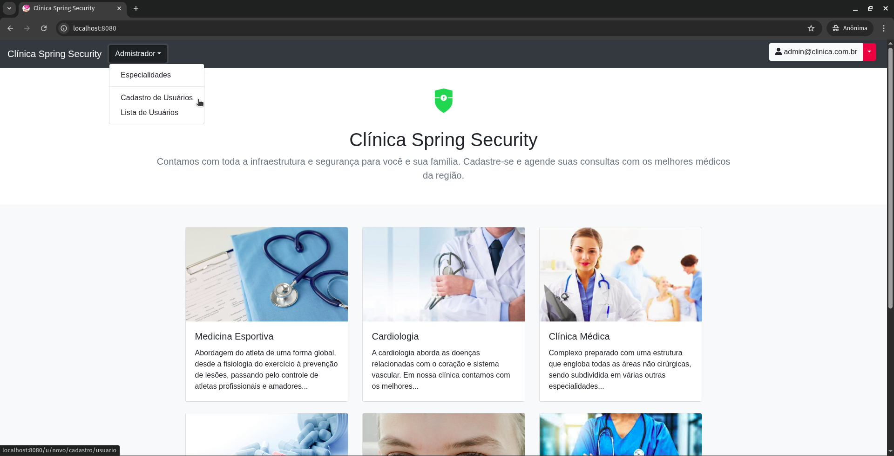
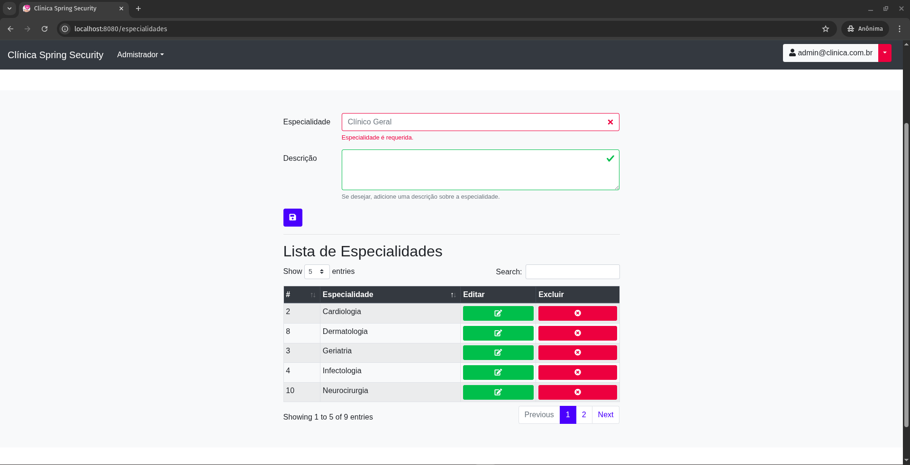
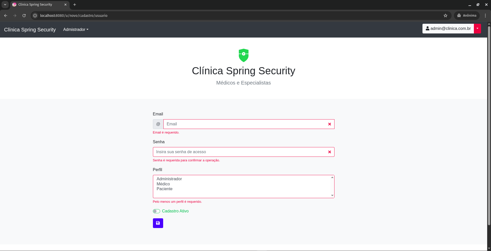
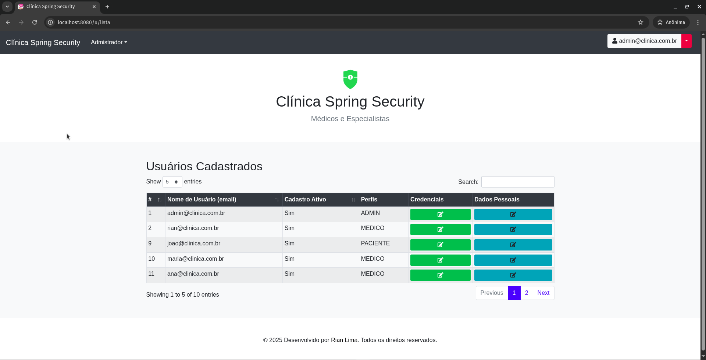
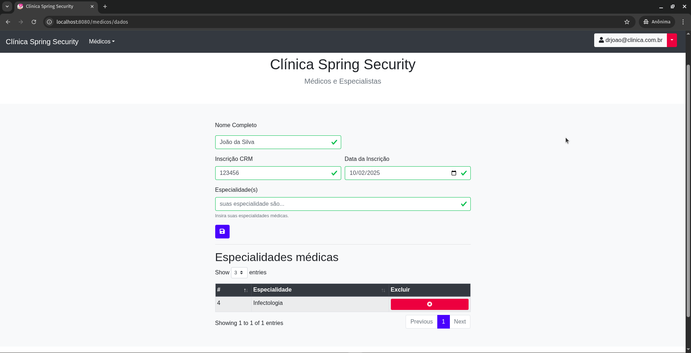
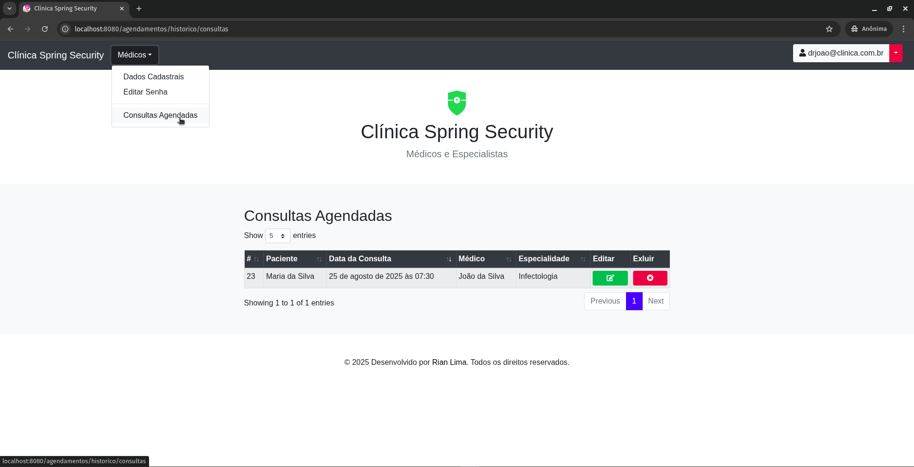
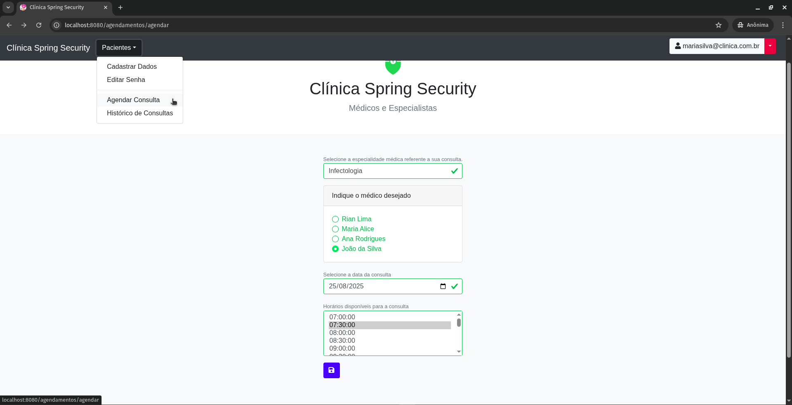

# Site de Clínica Médica

## Descrição do Sistema

Sistema de gerenciamento de clínica médica desenvolvido em **Java 8** com **Spring Boot** seguindo a arquitetura **MVC (Model-View-Controller)**. O sistema permite o gerenciamento de três tipos de usuários:

- **Administradores**: Gerenciam usuários, alteram permissões e credenciais do sistema
- **Médicos**: Recebem e gerenciam consultas médicas
- **Pacientes**: Solicitam consultas com médicos disponíveis

## Pré-requisitos
- Docker e Docker Compose instalados.

## Instruções para Executar

1. **Clone o repositório**
   ```bash
   git clone git@github.com:rlimapro/medical-clinic-mvc
   
   cd medical-clinic-mvc/

2. **Configure as variáveis de ambiente**
- Crie o arquivo `.env` baseado no template fornecido em `.env.example`:
    ```bash
    cp .env.example .env
- Edite o arquivo .env com suas configurações::
    ```bash
    # Database Configuration
    MYSQL_ROOT_PASSWORD=sua_senha_root_aqui
    MYSQL_DATABASE=demo_security

    # Application Database Configuration
    DB_USER=root
    DB_PASSWORD=sua_senha_root_aqui
    
    # Email Configuration (Gmail)
    SMTP_EMAIL=seu_email@gmail.com
    SMTP_PASSWORD=sua_senha_de_app_gmail
- ⚠️ **Importante**: Para o email funcionar, você deve:
  - Ativar a "Verificação em duas etapas" na sua conta Google
  - Gerar uma "Senha de app" específica para o sistema
  - Usar essa senha de app no campo `SMTP_PASSWORD`

3. **Inicie o sistema**
- Para construir e executar (necessário na primeira vez ou após alterações):
    ```bash
    docker-compose up --build
- Para executar sem reconstruir (se não houver mudanças):
    ```bash
    docker-compose up -d

4. **Acesse os serviços**
- **Aplicação principal**: http://localhost:8080
- **phpMyAdmin**: http://localhost:8081 
  - Servidor: deixe em branco
  - Usuário: root
  - valor definido em `MYSQL_ROOT_PASSWORD`

## Contribuição

1. Faça um fork do projeto
2. Crie uma branch para sua feature `git checkout -b feature/nova-feature`
3. Commit suas mudanças `git commit -am 'Adiciona nova feature'`
4. Push para a branch `git push origin feature/nova-feature`
5. Abra um Pull Request

## Screenshots

1. Administrador









2. Médico





3. Paciente

